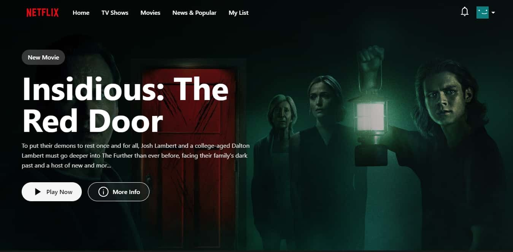

# Netflix Clone

## Table of contents

- [Overview](#overview)
  - [Responsive](#responsive)
  - [Screenshot](#screenshot)
  - [Links](#links)
- [My process](#my-process)
  - [Built with](#built-with)
- [Author](#author)

## Overview

### Responsive

Users should be able to:

- View the optimal layout for the site depending on their device's screen size
- See hover states for all interactive elements on the page

### Screenshot

### Links

- Live Site URL: [https://chic-nasturtium-3b31e3.netlify.app/](https://chic-nasturtium-3b31e3.netlify.app/)

## My process

### Built with

- Semantic HTML5 markup
- CSS custom properties
- Flexbox
- CSS Grid
- Mobile-first workflow
- [React](https://reactjs.org/) - JS library
- [tailwindcss](https://tailwindcss.com/) - CSS framework
- [Framer Motion](https://www.framer.com/motion/) - For Animations

## Author

- Website - [Karan Sethi](https://imkaranks.github.io/)